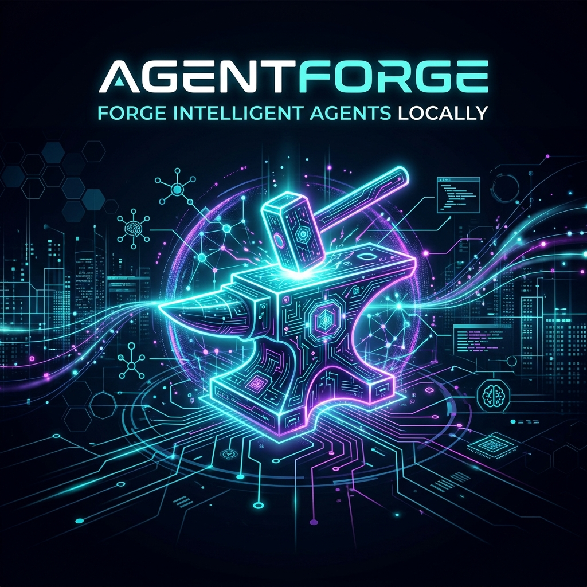

# AgentForge

<p align="center">
  
</p>

<p align="center">
  <strong>Forge Intelligent Agents Locally.</strong>
</p>

<p align="center">
  <a href="#license"></a>
  <a href="#build"></a>
  <a href="#chat"></a>
  <a href="#docker"></a>
</p>

---

**AgentForge** is an open-source, privacy-first, local-focused AI operating platform. It enables developers and AI enthusiasts to build, run, orchestrate, and automate multi-agent workflows using local and cloud-based models.

Run deep reasoning models on your local machine, hook up custom tools via the Model Context Protocol (MCP), render image workflows via ComfyUI, and orchestrate complex agent-to-agent operations using a visual drag-and-drop editor.

## Key Features

- 💬 **Multi-Model AI Chat**: Compare responses from different local and cloud-hosted models side-by-side.
- ⚙️ **Custom Agent System**: Configure system instructions, customize temperature profiles, select tools, and govern permissions.
- 🔗 **MCP Support (Model Context Protocol)**: Load and register any MCP server natively to connect files, databases, or third-party web apps.
- 🗺️ **Visual Workflow Editor**: Design parallel, sequential, or looping multi-agent pipelines with our interactive graph layout.
- 🚀 **Local AI Hub**: Direct integrations with Ollama, enabling you to inspect system memory, benchmark tokens/sec, and pull new GGUF models.
- 🎨 **ComfyUI Pipeline Integration**: Auto-generate visuals, run cinematic prompt generators, and fetch generation outputs dynamically inside tool actions.
- 📝 **Content Studio**: Standard templates designed to write blogs, script screenplays, generate social content, and compose lyrics with markdown previews.
- 🔒 **Sandboxed Executions**: Runs local Python scripts and console commands within a containerized sandbox to safeguard your local machine.

---

## Comparison Matrix

| Feature | **AgentForge** | Open WebUI | n8n / Flowise | CrewAI / AutoGen |
| :--- | :---: | :---: | :---: | :---: |
| **Local-First / Privacy-First** | ✅ | ✅ | ⚠️ (Requires setup) | ⚠️ (Code-first) |
| **Visual Workflow Builder** | ✅ | ❌ | ✅ | ❌ |
| **MCP Client Integration** | ✅ | ❌ | ❌ | ❌ |
| **ComfyUI Execution Pipeline** | ✅ | ❌ | ❌ | ❌ |
| **No-Code / Developer Hybrid** | ✅ | ❌ | ✅ | ❌ (Python only) |
| **Sandboxed Code Execution** | ✅ | ❌ | ⚠️ | ❌ (Runs bare-metal) |

---

## Quick Start (Docker Compose)

The fastest way to launch the full AgentForge platform including Vector DBs, databases, and local interfaces is using Docker Compose:

```bash
# Clone the repository
git clone https://github.com/malky-labs/AgentForge.git
cd AgentForge

# Start all services
docker compose -f docker/docker-compose.yml up -d
```

Access the Next.js Frontend dashboard at `http://localhost:3000`.

---

## Local Developer Setup

If you prefer to run the development components individually:

### Backend (FastAPI)
Prerequisites: Python 3.11+, virtual environment setup.

```bash
cd backend
python -m venv venv
source venv/bin/activate  # Or venv\Scripts\activate on Windows
pip install -r requirements.txt
uvicorn app.main:app --reload
```

### Frontend (Next.js)
Prerequisites: Node.js 18+ or 20+.

```bash
cd frontend
npm install
npm run dev
```

---

## Community & Contributing

We love contributions! Please read our [Contributor Onboarding Plan](.github/pull_request_template.md) to understand how to:
1. Submit pull requests.
2. Resolve styling and formatting (ruff / prettier).
3. Test integrations.
4. Get help via the [Discord Server](https://discord.gg/agentforge).

## License
Distributed under the Apache 2.0 License. See `LICENSE` for more information.
